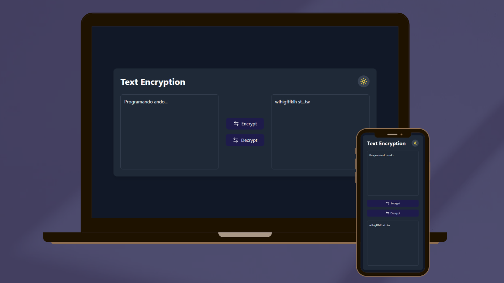

<!-- PROJECT PRESENTATION -->
<div align="center">

  <h1 align="center">🔐 Argus Encryption Solver</h1>

<text>
Este proyecto contiene el frontend que permite a los usuarios desencriptar 
mensajes utilizando una interfaz de usuario moderna. 
Está desarrollado con React, utilizando Vite, TypeScript, y TailwindCSS para la estilización.
</text>
  <p align="center">
    <a href="">Reportar Bug</a>
    |
    <a href="">Solicitar Feature</a>
  </p>
</div></br>


## 🚀 Funcionalidad

La interfaz permite a los usuarios ingresar un mensaje encriptado y obtener el resultado desencriptado siguiendo el proceso de encriptación explicado por Argus.



## 🛠️ Instalación y Configuración

1.  Instala las dependencias de NPM
2. Ejecuta la aplicación con Vite
3. La aplicación frontend estará disponible en http://localhost:5173
   ```bash
   npm install
   npm run dev

## 🖼️ Interfaz de Usuario
Minimalista: Usa TailwindCSS para crear una experiencia de usuario fluida.

Interacción simple: El usuario introduce el mensaje encriptado y pulsa en 
"Desencriptar" para ver el resultado y viceversa.

## 👩🏻‍💻 Mejoras Futuras
Soporte para múltiples tipos de encriptación.
Mejorar la experiencia de usuario con más animaciones y transiciones.
